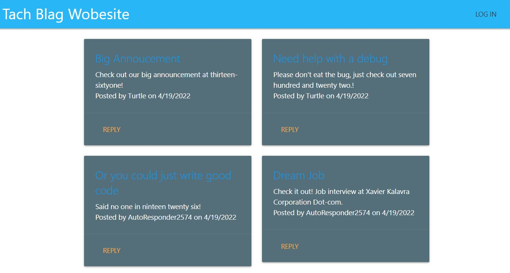

# [Tach_Blag_Wobesite](https://github.com/DanielMrva/Tach_blag_wobesite) 
  
  ## Description
  Tach Blag Wobesite is a basic blogging website built using Node, Express, Sequelizie, and Handlebars.  Users may log in and create posts (which can later be edited or deleted by the user) and reply to posts (which can likewise be edited or deleted).  The site utilizes the MVC file structure, and a simple relational database.

  

  ## Table of Conents
   1. [Installation](#installation)
   1. [Usage](#usage)
   1. [Contribution](#contribution)
   1. [Questions](#questions)
   1. [Links](#links)
   1. [License](#license)
  
  ## Installation
  If you would like to run this website locally, please follow the steps below (this assumes GitHub account, MySql account, etc):

      1. Go to the repo on GitHub and Click the Code => Clone buton.
      2. Navigate to your desired directory in terminal or code editor and run git clone (paste in the link coppied from github)
      3. Once the repo is cloned, navigate to the repo's directory and run npm i to install dependencies.
      4. Edit the .env.EXAMPLE file to be .env and add in your MySQL Password as DB_PASSWORD, and a secret as SECRET.
      5. Log in to MySQL and run "source ./db/schema.sql". Exit MySQL.
      6. If you would like the pre-generated seed data run NPM RUN SEED
      7. To launch the server run npm start, from there you can navigate to http://localhost:3001 to test the site.
  
  
  
  ## Usage 
  Users may create an account, create posts, reply to posts, and edit or delete their posts or replies.  Post creation, and reply or post deletion/editing are accessable from the User's Dashboard.  

  

  

  

  ## Contribution
  If you would like to contribute, please feel free contact me via devmail.
  
   ## Questions
  Devmail via GitHub

  Feel free to follow or contact me at my GitHub page: [DanielMrva](https://github.com/DanielMrva)
  
  
  ## Links
  [Tach_Blag_Wobesite-Repo](https://github.com/DanielMrva/Tach_blag_wobesite)

  [Tach_Blag_Wobesite-Deployed](https://tach-blag-wobesite.herokuapp.com/)

  [XKCD](https://xkcd.com/148)

  ## License 
  MIT